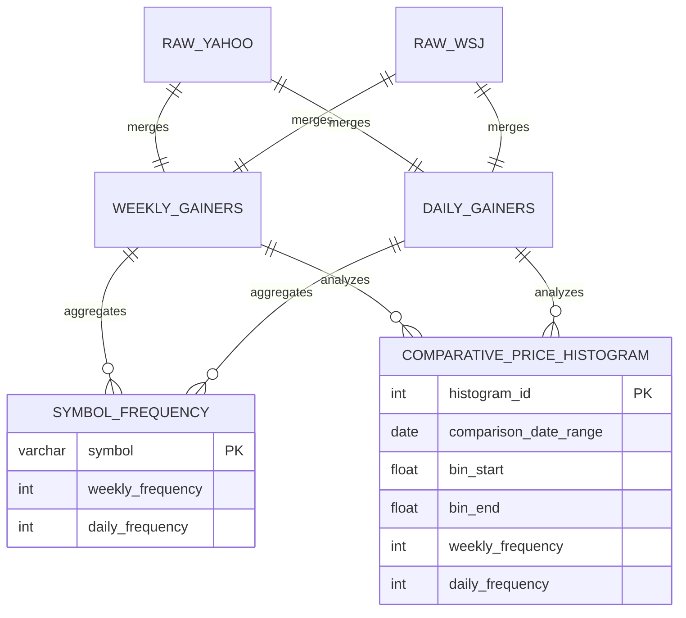

## Comparing Performance of Gainers on Daily and Weekly Timescales

## This ERD shows how we take our automated stock gainers collection and turn it into a meaningful graphic. By showing the intermediate steps we better conceptualize the process ourselves and gain a new tool in explaining how data science works.

## Use Cases

## One key use case involves identifying stocks that consistently appear in the daily and weekly gainers lists. By tracking the frequency of symbols across both timeframes, we can pinpoint potentially significant or trending stocks with respect to the length of time being considered. This could provide insights into things such as volatility.

## Another important use case is comparing the price of a given set of stocks on a weekly and daily basis. Showing the audience how viewing the problem from different temporal lenses again gives insights into the riskiness and long term potential for stocks.

## Methods

## The data processing pipeline begins with two raw data sources: `RAW_YAHOO` and `RAW_WSJ`. These tables contain daily stock information, including symbols and price changes. This raw data is then processed to create two intermediate tables: `WEEKLY_GAINERS` and `DAILY_GAINERS`. These tables will hold the lists of top gainers for the respective timeframes, containing stock symbols and the percentage or absolute gain.

## The `WEEKLY_GAINERS` and `DAILY_GAINERS` tables are then aggregated to populate the final tables. The `SYMBOL_FREQUENCY` table counts the occurrences of each stock symbol within both the weekly and daily gainer lists. This allows for easy identification of recurring stocks. The `COMPARATIVE_PRICE_HISTOGRAM` table analyzes the price data from the `WEEKLY_GAINERS` and `DAILY_GAINERS` to create histograms representing the distribution of prices within each timeframe. This table allows for a direct comparison of price ranges between daily and weekly gainers.

## Summary

## While this design covers the specified use cases, further data enrichment could lead to more interesting results. For instance, incorporating hourly, monthly, and yearly data could provide a more wholistic view of gainer performance but would require additional efforts to make visually appealing.
